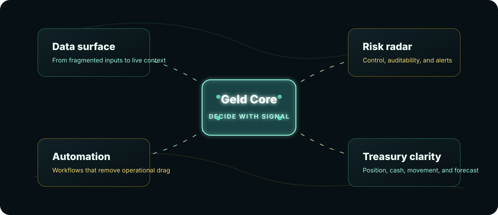

  

<h1 align="center">Geld Intelligence</h1>

  <strong>.</strong>

  
  
  

---

## We build decision infrastructure

GeldIntel turns financial operations into a living intelligence layer. We care
about the hard part: bringing money movement, operational data, control signals,
and product workflows into one clear system.

Our 2026 direction is simple:

- Replace passive reports with active decision surfaces.
- Make finance workflows observable, automatable, and auditable.
- Design tools that are fast enough for operators and clear enough for leaders.
- Keep AI close to the workflow, not floating beside it.

  

## The stack language

We ship with a bias for typed systems, tight feedback loops, accessible
interfaces, and automation that can survive production.

  
  
  
  
  
  
  

## What guides the work

| Signal | What it means here |
| --- | --- |
| Clarity | Every screen should answer, "What changed, why, and what now?" |
| Control | Money systems need permissions, audit trails, and predictable behavior. |
| Speed | Interfaces and APIs should feel immediate, even under real workload. |
| Intelligence | AI should compress decisions, not add another place to check. |
| Trust | Automation earns its place through observability and reversibility. |

## Current public surface

This organization profile is the first public artifact. The broader engineering
surface can expand as repositories become public.

- Organization: [github.com/geldintel](https://github.com/geldintel)
- Profile repository: [geldintel/.github](https://github.com/geldintel/.github)

## Build with us

We are designing the operating layer for financial intelligence: part product
system, part automation fabric, part decision cockpit.

If that sounds like the kind of frontier you want to shape, follow the
organization and watch this space.

---

  
    GeldIntel, 2026. Built for signal, speed, and financial clarity.
  

